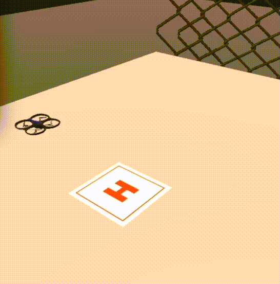
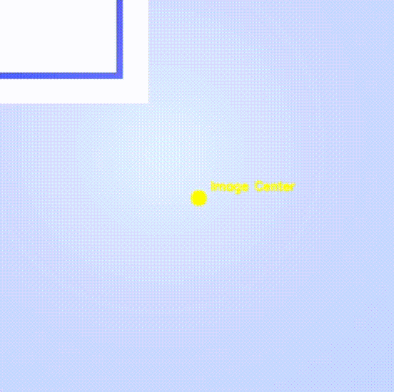

# Autonomous Drone Landing System



---

## Table of Contents

- [Autonomous Drone Landing System](#autonomous-drone-landing-system)
  - [Table of Contents](#table-of-contents)
  - [Overview](#overview)
    - [Key Features:](#key-features)
  - [Landing Process in Action](#landing-process-in-action)
    - [Downward Camera View](#downward-camera-view)
  - [Installation](#installation)
  - [Usage](#usage)
  - [Project Structure](#project-structure)
  - [Technologies Used](#technologies-used)
  - [Contributing](#contributing)
    - [Steps to Contribute:](#steps-to-contribute)
  - [License](#license)

---

## Overview


This project focuses on an autonomous drone landing system that uses visual and distance-based sensors. The primary objective is to enable the drone to detect a landing pad with a downward-facing RGB camera and calculate the distance from the ground using a **VL53 distance sensor**. The system leverages advanced image processing and control mechanisms to ensure a safe and accurate landing.

### Key Features:

- **Autonomous Landing Pad Detection:** Utilizes an RGB camera and image processing techniques.
- **Distance Measurement:** Employs a VL53 sensor for real-time altitude assessment.
- **Landing Control:** Integrates Proportional-Integral-Derivative (PID) control for dynamic throttle adjustments and precise positioning.
- **Robust Detection:** Combines YOLO (for object detection), OpenCV (for real-time image processing), and OCR (Tesseract) for identifying the landing pad and its "H" symbol.
- **Simulation Support:** Includes Unity-based simulations for testing and training, compatible with macOS, Linux, and Windows, and leverages `mlagents_envs` for seamless integration of Unity simulations into Python workflows.

---

## Landing Process in Action

Here is example of the landing process captured during testing:

### Downward Camera View



---

## Installation

Follow these steps to set up the project:

1. **Clone the Repository:**

   ```bash
   git clone https://github.com/Oneiben/autonomous-drone-landing-system.git
   cd autonomous-drone-landing-system
   ```

2. **Install Dependencies:**
   Make sure you have Python 3.10.12 installed, then install the required packages using:
   ```bash
   pip install -r requirements.txt
   ```

---

## Usage

1. **Set up your simulation environment:**
   Open [main.py](scripts/main.py) and ensure the simulation build matches your operating system by editing the last lines of the script:

   - For Linux, set the simulation path to `simulations/linux_build/`.
   - For macOS, set it to `simulations/macos_build/`.
   - For Windows, set it to `simulations/windows_build/`.

2. **Launch the main script to start the landing system:**

   ```bash
   python scripts/main.py
   ```

3. **Test Detection Methods:**
   Use the test scripts in the [📂 tests](./tests/) folder to validate the detection methods with a webcam. YOLO models located in [📂 models](./models/) are used for detecting two landing pads. Ensure the model names align with the images provided in the [📂 landing_pad_images](./landing_pad_images/) directory.
   - Example for testing YOLO:
     ```bash
     python tests/ip_test_Yolo.py
     ```

---

## Project Structure

```plaintext
autonomous-drone-landing-system/
├── landing_progress_gifs/  # GIFs showing the landing process from different angles
│   ├── Downward.gif
│   ├── Main.gif
├── landing_pad_images/     # Images of the landing pad
│   ├── landing_pad.png
│   ├── LandingPad.jpg
├── models/                 # YOLO model weights and configurations
├── scripts/                # Python scripts for the landing system and utilities
│   ├── control_actions.py
│   ├── image_processing.py
│   ├── main.py
│   ├── simulation.py
├── simulations/            # Unity simulations for various platforms
│   ├── linux_build/
│   ├── macos_build/
│   ├── windows_build/
├── tests/                  # Unit tests for validating components
│   ├── ip_test_cv2.py
│   ├── ip_test_pytesseract.py
│   ├── ip_test_yolo.py
├── README.md               # Documentation for the project
├── requirements.txt        # List of Python dependencies
```

---

## Technologies Used

- **Python:** Core language for development.
- **YOLO:** Object detection for landing pad recognition.
- **OpenCV:** Image processing library.
- **Tesseract OCR:** Letter detection for identifying the "H" symbol.
- **VL53 Distance Sensor:** Measures altitude.
- **PID Control:** Ensures precise and smooth adjustments for safe landing.
- **Unity:** Used for creating and running drone landing simulations.
- **mlagents_envs:** Provides a `UnityEnvironmentWrapper` for interfacing Python with Unity simulations.

---

## Contributing

Contributions are welcome! If you have suggestions or improvements, feel free to fork the repository and create a pull request.

### Steps to Contribute:

1. Fork the repository.
2. Create a new branch:
   ```bash
   git checkout -b feature-name
   ```
3. Commit your changes:
   ```bash
   git commit -m "Description of changes"
   ```
4. Push the changes and open a pull request.

---

## License

This project is licensed under the MIT License. See the [📜 LICENSE](LICENSE) file for more details.
